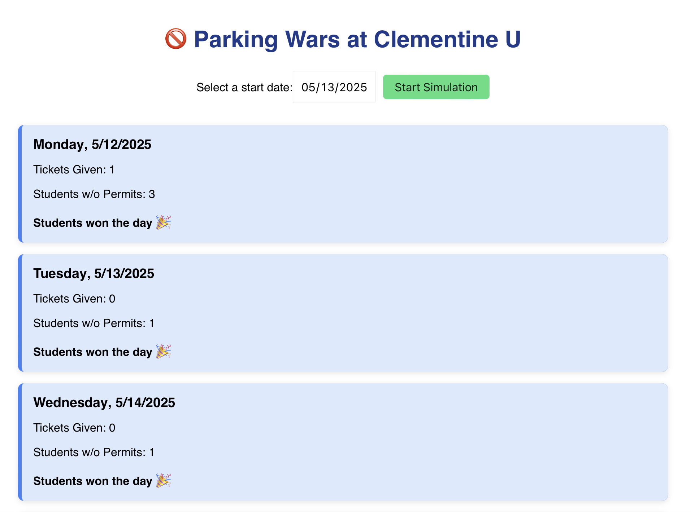
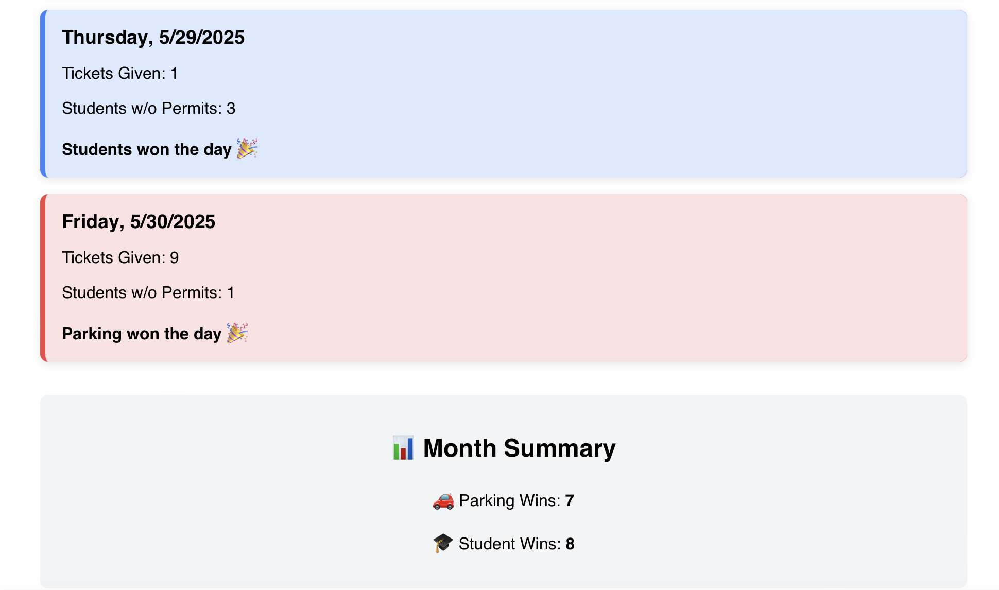

# 🚫 Parking Wars: Clementine University Simulator

A modern, interactive **React-based simulation** that reenacts the legendary battle between **students** and **parking services** at Clementine University.

📆 Choose a start date → simulate daily battles → see who dominates the month: 🎓 or 🚗

---

## 🔗 Live Demo

🌐 [View on Netlify](https://parkingwars.netlify.app)

---

## 🎮 Features

- 📅 **Date picker** to start your simulation
- 📊 **Daily logs** showing ticket counts and student behavior
- 🧠 Weighted random logic (based on your C++ version)
- 🏆 **Summary panel** with win tallies for each side
- 💅 Responsive, high-end CSS design

---

## 🧠 Simulation Logic

### 🎓 Students Parking Without Permits

Based on weighted random chance:
- 50% chance: +3 students
- 35% chance: +1 student
- 15% chance: +6 students

### 🚗 Parking Tickets Given

- 35% chance: 0 tickets
- 30% chance: 9 tickets
- 30% chance: 1 ticket
- 5% chance: 12 tickets

---

## 🛠️ Tech Stack

| Layer     | Tools                   |
|-----------|-------------------------|
| Frontend  | React, JavaScript       |
| Styling   | Plain CSS               |
| Deployment | Netlify / GitHub Pages |

---

## 🧪 How to Run Locally

```bash
git clone https://github.com/TrishaAndres/parking-wars-simulation.git
cd parking-wars-simulation
npm install
npm start
```
Runs at http://localhost:3000

---

## 📸 Screenshots 




